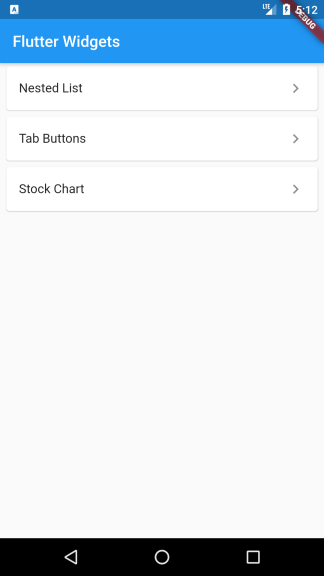

# flutter-widgets-explorer

The Flutter Widgets Explorer project is created to learn, test and demo flutter widgets in one application.

## Getting Started

The first screen launched in the app is a list of widget names. 
After select a widget name, the selected widget details will show on next screen.

 

Each widget will be coded in separate branch and come with it's own readme file.

## Branches:

<table border="1" cellspacing="0" cellpadding="0">
<tr valign="top">
<td>
<a href="intro.md" target="_blank">

 <strong>base</strong>: Basic skeleton of the Flutter Widgets Explorer project. If you would like to create similar project, you can start here!
</a> 
</td>
<td>
<a href="lib/nested_list/README.md" target="_blank">

 <strong>nested_list</strong>: Nested vertical and horizontal list with dynamic content in the list item.
</a> 
</td>
<td>
<a href="lib/tab_buttons/README.md" target="_blank">

 <strong>tab_buttons</strong>: tabbar where each tab indicator is a toggle button.
</a> 
</td>
</tr>
<table>

## General References

- [Lab: Write your first Flutter app](https://flutter.dev/docs/get-started/codelab)
- [Cookbook: Useful Flutter samples](https://flutter.dev/docs/cookbook)
- [Online documentation](https://flutter.dev/docs)
- [flutter-examples: An ultimate cheatbook of curated designs](http://flutterexamples.com/)