# Fluwix (formerly Flutter Widgets Explorer) 

The Fluwix is a Flutter showcases platform on the mobile apps and web.

Alternatively, you can see it on the web at [fluwix.com](http://fluwix.com).

## Getting Started

The first screen launched in the app is a list of showcases. 
After select a showcase, the selected showcase details will show on next screen.

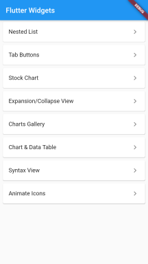

Each showcase will be coded in it's own branch and module, can have it's own readme or license file, please see [Steps To Add Your Showcase](showcase_view/SHOWCASE_YOUR_WIDGETS.md) for more information.

## Branches:

<table border="1" cellspacing="0" cellpadding="0">
<tr valign="top">
<td width="33.3%">
<a href="intro.md" target="_blank">

 <strong>base</strong>: Basic skeleton of the Fluwix project. If you would like to create similar project, you can start here!
</a> 
</td>
<td width="33.3%">
<a href="nested_list/README.md" target="_blank">
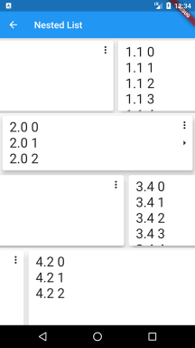
 <strong>nested_list</strong>: Nested horizontal list with dynamic content in vertical list items.
</a> 
</td>
<td width="33.3%">
<a href="tab_buttons/README.md" target="_blank">
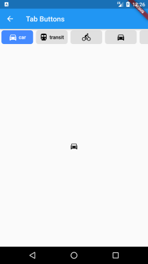
 <strong>tab_buttons</strong>: tabbar where each tab indicator is a toggle button.
</a> 
</td>
</tr>
<tr valign="top">
<td width="33.3%">
<a href="stock_chart/README.md" target="_blank">
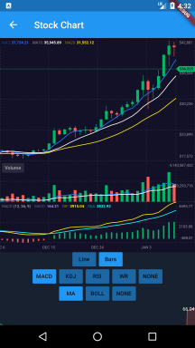
 <strong>stock_chart</strong>: Stock candlestick or line chart with indicators support.
</a> 
</td>
<td width="33.3%">
<a href="expansion_collapse_view/README.md" target="_blank">
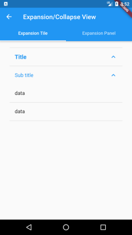
 <strong>expansion_collapse_view</strong>: Expansion/Collapse view using Flutter built-in widgets.
</a> 
</td>
<td width="33.3%">
<a href="charts_gallery/README.md" target="_blank">
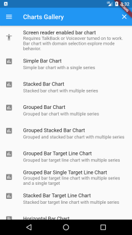
 <strong>charts_gallery</strong>: Charts Gallery show case the data visualization capability of the charts_flutter package.
</a> 
</td>
</tr>
<tr valign="top">
<td width="33.3%">
<a href="chart_data_table/README.md" target="_blank">
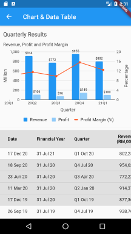
 <strong>chart_data_table</strong>: Real world quarterly results in combo chart and tabular format.
</a> 
</td>
<td width="33.3%">
<a href="syntax_view/README.md" target="_blank">
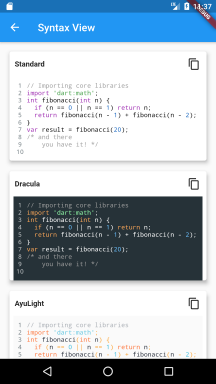
 <strong>syntax_view</strong>: View code, copy and paste.
</a> 
</td>
<td width="33.3%">
<a href="animated_icons/README.md" target="_blank">
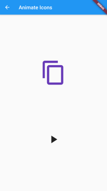
 <strong>animated_icons</strong>: Animate any two icons.
</a> 
</td>
</tr>
<tr valign="top">
<td width="33.3%">
<a href="url_launcher_showcase/README.md" target="_blank">
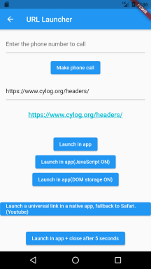
 <strong>url_launcher_showcase</strong>: Launch a URL to browse website, make phone call, send Email or SMS.
</a> 
</td>
<td width="33.3%">
<a href="markdown_view/README.md" target="_blank">
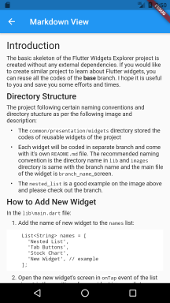
 <strong>markdown_view</strong>: Display Markdown file from Github repository.
</a> 
</td>
</td>
<td width="33.3%">
<a href="shimmer_effect/README.md" target="_blank">
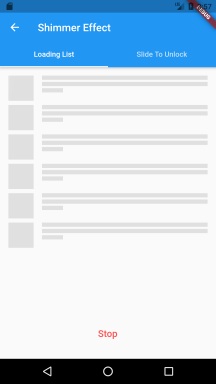
 <strong>shimmer_effect</strong>: Better way to show loading status.
</a> 
</td>
</tr>
<tr valign="top">
<td width="33.3%">
<a href="about_dialog/README.md" target="_blank">
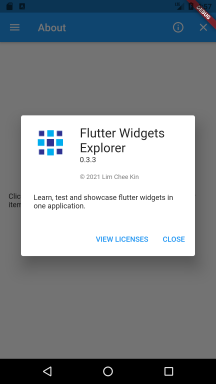
 <strong>about_dialog</strong>: About the application and licenses.
</a> 
</td>
<td width="33.3%">
<a href="source_code_view/README.md" target="_blank">

 <strong>source_code_view</strong>: Share your source code of Github public repository.
</a> 
</td>
<td width="33.3%">
<a href="showcase_view/README.md" target="_blank">
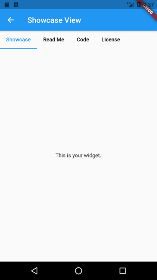
 <strong>showcase_view</strong>: Showcase your widget with read me, codes and license.
</a>
</td>
</tr>
<tr valign="top">
<td width="33.3%">
<a href="material_design_showcase/README.md" target="_blank">
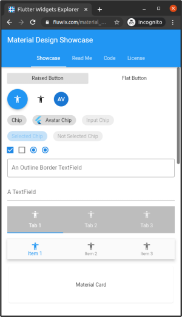
 <strong>material_design_showcase</strong>: Showcase Material Design components.
</a> 
</td>
<td width="33.3%">
<a href="percent_indicator_showcase/README.md" target="_blank">
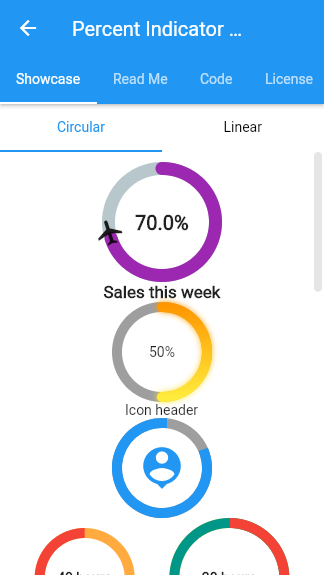
 <strong>percent_indicator_showcase</strong>: Showcase Circular and Linear percent indicators.
</a> 
</td>
<td width="33.3%">
<a href="glassmorphism_design/README.md" target="_blank">
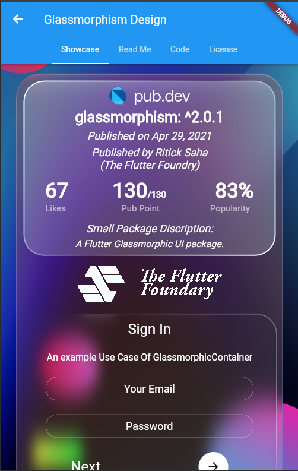
 <strong>glassmorphism_design</strong>: Simplify the creation of Glassmorphic Container.
</a> 
</td>
</tr>
<tr valign="top">
<td width="33.3%">
<a href="neumorphism_design/README.md" target="_blank">
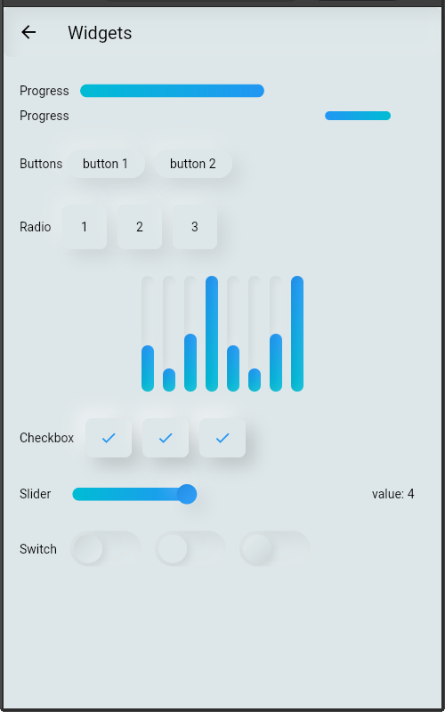
 <strong>neumorphism_design</strong>: A complete, ready to use, Neumorphic UI kit.
</a> 
</td>
<td width="33.3%">
<a href="settings_ui_showcase/README.md" target="_blank">
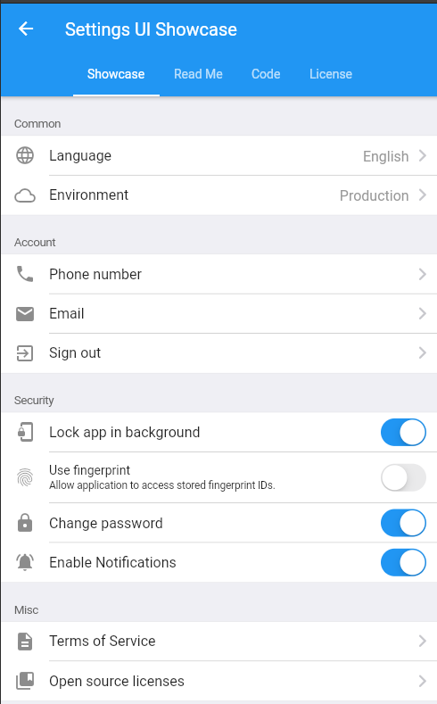
 <strong>settings_ui_showcase</strong>: Create native settings for Flutter app in minutes.
</a> 
</td>
<td width="33.3%">
<a href="search_bar/README.md" target="_blank">
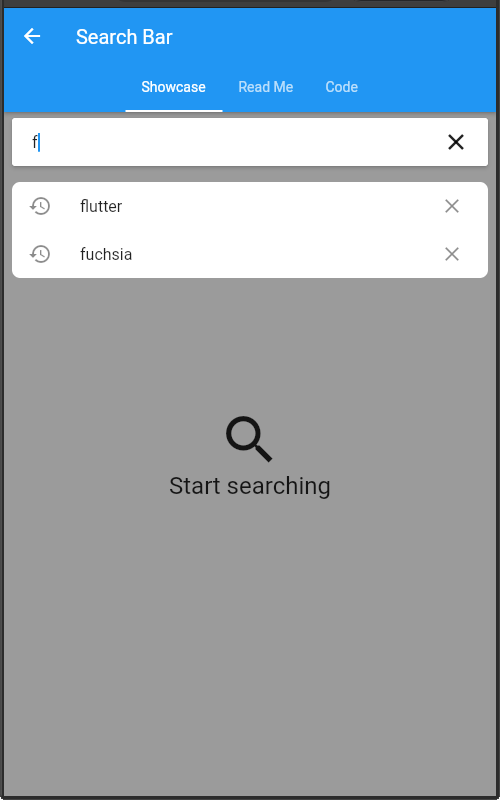
 <strong>search_bar</strong>: An expandable floating search bar similar to the one Google used in their own apps.
</a> 
</td>
</tr>
<tr valign="top">
<td width="33.3%">
<a href="rich_text_editor/README.md" target="_blank">
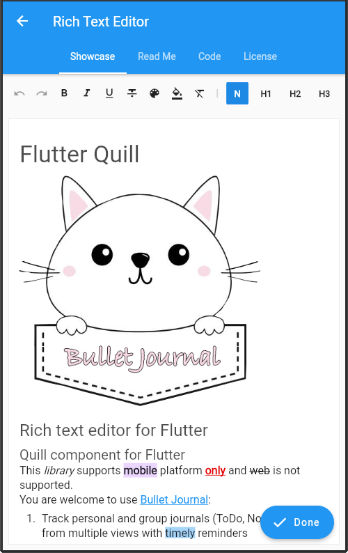
 <strong>rich_text_editor</strong>: FlutterQuill: A rich text editor for Flutter.
</a> 
</td>
<td width="33.3%">
</td>
<td width="33.3%">
</td>
</tr>
<table>

## General References

- [Lab: Write your first Flutter app](https://flutter.dev/docs/get-started/codelab)
- [Cookbook: Useful Flutter samples](https://flutter.dev/docs/cookbook)
- [Online documentation](https://flutter.dev/docs)
- [flutter-examples: An ultimate cheatbook of curated designs](http://flutterexamples.com/)
- [TodoMVC for Flutter](https://github.com/brianegan/flutter_architecture_samples)
- [Open Source Flutter Apps](https://github.com/tortuvshin/open-source-flutter-apps)
- [Flutter Samples by the Flutter Team](https://flutter.github.io/samples/#)
- [Flutter Gems - A Curated Package Guide for Flutter](https://fluttergems.dev/)
- [Flutter Layouts Demo](https://github.com/bizz84/layout-demo-flutter)
- [Flutter Community Plus Plugins](https://github.com/fluttercommunity/plus_plugins)