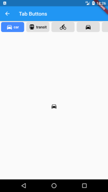
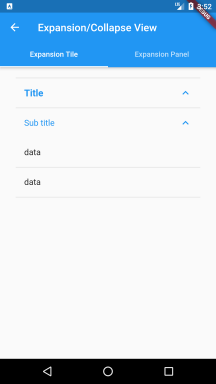
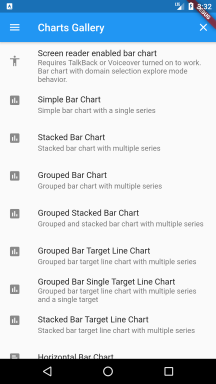
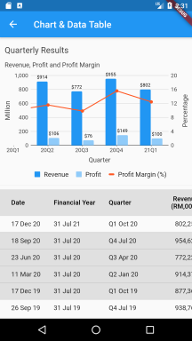
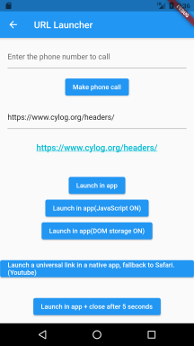
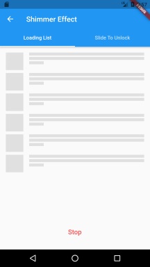

# flutter-widgets-explorer

The Flutter Widgets Explorer is created to learn, test and demo flutter widgets in one application.

## Getting Started

The first screen launched in the app is a list of widget names. 
After select a widget name, the selected widget details will show on next screen.

 

Each widget will be coded in separate branch and come with it's own readme file.

## Branches:

<table border="1" cellspacing="0" cellpadding="0">
<tr valign="top">
<td width="33.3%">
<a href="intro.md" target="_blank">

 <strong>base</strong>: Basic skeleton of the Flutter Widgets Explorer project. If you would like to create similar project, you can start here!
</a> 
</td>
<td width="33.3%">
<a href="lib/nested_list/README.md" target="_blank">

 <strong>nested_list</strong>: Nested horizontal list with dynamic content in vertical list items.
</a> 
</td>
<td width="33.3%">
<a href="lib/tab_buttons/README.md" target="_blank">

 <strong>tab_buttons</strong>: tabbar where each tab indicator is a toggle button.
</a> 
</td>
</tr>
<tr valign="top">
<td width="33.3%">
<a href="lib/stock_chart/README.md" target="_blank">

 <strong>stock_chart</strong>: Stock candlestick or line chart with indicators support.
</a> 
</td>
<td width="33.3%">
<a href="lib/expansion_collapse_view/README.md" target="_blank">

 <strong>expansion_collapse_view</strong>: Expansion/Collapse view using Flutter built-in widgets.
</a> 
</td>
<td width="33.3%">
<a href="lib/charts/README.md" target="_blank">

 <strong>charts</strong>: Charts Gallery show case the data visualization capability of the charts_flutter package.
</a> 
</td>
</tr>
<tr valign="top">
<td width="33.3%">
<a href="lib/chart_datatable/README.md" target="_blank">

 <strong>chart_datatable</strong>: Real world quarterly results in combo chart and tabular format.
</a> 
</td>
<td width="33.3%">
<a href="lib/syntax_view/README.md" target="_blank">

 <strong>syntax_view</strong>: View code, copy and paste.
</a> 
</td>
<td width="33.3%">
<a href="lib/animate_icons/README.md" target="_blank">

 <strong>animate_icons</strong>: Animate any two icons.
</a> 
</td>
</tr>
<tr valign="top">
<td width="33.3%">
<a href="lib/url_launcher/README.md" target="_blank">

 <strong>url_launcher</strong>: Launch a URL to browse website, make phone call, send Email or SMS.
</a> 
</td>
<td width="33.3%">
<a href="lib/markdown/README.md" target="_blank">

 <strong>markdown</strong>: Display Markdown file from Github repo.
</a> 
</td>
</td>
<td width="33.3%">
<a href="lib/shimmer/README.md" target="_blank">

 <strong>shimmer</strong>: Better way to show loading status.
</a> 
</td>
</tr>
<table>

## General References

- [Lab: Write your first Flutter app](https://flutter.dev/docs/get-started/codelab)
- [Cookbook: Useful Flutter samples](https://flutter.dev/docs/cookbook)
- [Online documentation](https://flutter.dev/docs)
- [flutter-examples: An ultimate cheatbook of curated designs](http://flutterexamples.com/)