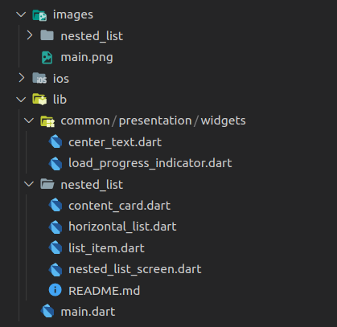

# Introduction

The basic skeleton of the Flutter Widgets Explorer project is created without any external dependencies. If you would like to create similar project to learn about Flutter widgets, you can reuse all the codes of the __base__ branch. I hope it is useful to you and save you some efforts and times.

## Directory Structure

The project following certain naming conventions and directory stucture as per the following image and description:
<p> 

</p>

- The `common/presentation/widgets` directory stored code of reusable widgets of the project

- Each widget will be coded in separate branch and come with it's own `README.md` file. The recommended naming convention is the directory name in `lib` and `images` directory is same with the branch name and the main file of the widget is `branch_name`_screen.

- The `nested_list` is a good example on the image above and please check out the branch.

## How to Add New Widget
In the `lib\main.dart` file:
1. Add the name of new widget to the `names` list:
```dart
    List<String> names = [
      'Nested List',
      'Tab Buttons',
      'Stock Chart',
      'New Widget', // example
    ];
```
2. Open the new widget's screen in `onTap` event of the list view, `3` is the position of new widget in `names` list:
```dart
    onTap: () {
        switch (position) {
        case 0:
            _gotoScreen(context, NestedListScreen());
            break;
        case 3: // example
            _gotoScreen(context, NewWidgetScreen()); // example
            break; // example
        }
    },
```
